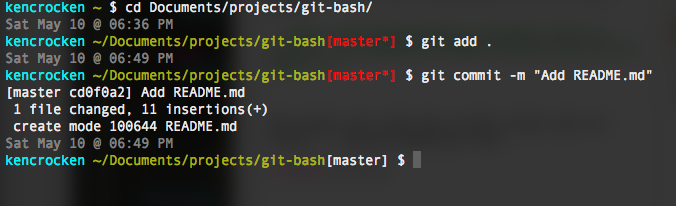

###Customize the commandline and display git branch with status.

A function allows for the display of git branch.  The use of variables for colorcodes and common items allow easy customizing.  For example:

`export PS1="$IBlack$date @ $time12a $newLine$ICyan\u $Yellow$pathFull$IWhite\$(parse_git_branch)$IWhite $ "
`

The prompt will show the current branch and its status -- looking something like:

Mostly based on Customize BASH PS1 prompt to show current GIT repository and branch by Mike Stewart - http://MediaDoneRight.com.  The rest is from a series of Google searches and sources I can't quite recall.  